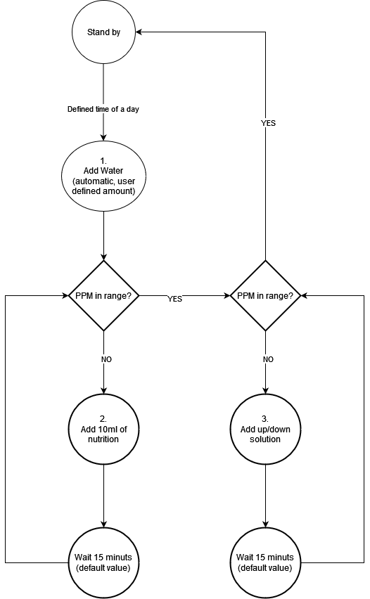
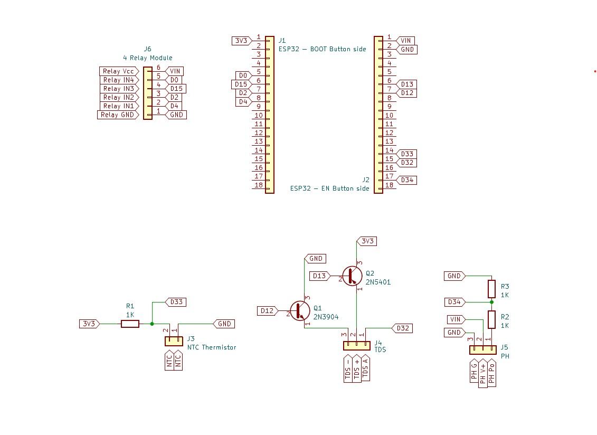

# ESPHome-Hydroponics
This project was made as a semestral project to the subject: Distributed systems 
Faculty: Information technology 
Institution: Brno University of Technology 
 
Hydroponics presents a fascinating approach to cultivating flowering organisms without the use of soil. Flowers, vegetables, and fruits can derive their nutrition and essential environment from preprocessed water. By incorporating specific components, we have developed an automated system capable of monitoring and regulating both nutrients and pH levels, ensuring optimal conditions for the cultivated plants. 
 
The whole system runs on an ESP32 microcontroller. To meet the environment requirements for cultivating a specific plant, system's properties can be monitored and adjusted via a dashboard in Home Assistent's ESPHome add-on. There are three major properties of the nutrient solution to monitor in the current solution: temperature, pH and ppm. The last two can be configured as a range suitable for a specific plant. 
 
For temperature measurements a waterproof NTC thermistor ([1]) is used. The optimal range in which the temperature should fluctuate is 65-75°F (~18-24°C). In the current solution the changes in temperature (if needed) has to be handled externally. 
 
## Design of automated Hydroponics system
A vital essence for the plant's growth is the proper nutrition which is mediated by the circulation of the nutrient solution. The composition and concentration of the solution in question is specific to the plant being cultivated. The solution itself is composed of dissolved minerals and salts (ions) and its concentration (TDS - total dissolved solids) can be measured using several units (mS, cF, ppm). The most intuitive is probably ppm (parts per million). The concentration is usually a range with the optimum somewhere between 800 and 1500 ppm. In our case, we used a TDS sensor meter ([2]) to monitor the concentration of the nutrient solution and to control pumping more nutrients into it in case the concentration drops under the lower bound of the range previously configured by user. This handles the situation in which the plant consumed the nutrition and so the solution is less concentrated afterwards. Similar approach can be implemented (as an extention to our current system) for pumping clean water into the solution in case of excessive water evaporation during hot days when the solution gets more concentrated and exceeds the upper bound. 
 
The adjustments of concentration of the nutrient solution precede the pH measurements. It also takes some time to let the solution mix up properly and so the adjustments are repeated several times before the system can proceed with measuring pH. pH is then measured using a special pH sensor module ([3]) and with the same approach as in the case of TDS, the pH of the nutrient solution is adjusted by pumping either basic (< pH_min) or acidic (> pH_max) solution into it. The optimal range of pH for the majority of plants is between 5.5 and 6.5 which is mostly neutral. Note that in order to use the pH sensor module, it needs to be calibrated first using a solution with known pH (see source [2]). 
 

**Important**: Having the TDS meter and the pH meter functioning both at the same time in the same vessel with the nutrient solution, the pH measurements were greatly disturbed by those of TDS. This could lead to bad pH management and ruining of the plant's health. The solution to this problem is having the power conductors of the TDS meter isolated and inactive when reading the pH sensor value. This is done by placing two protective transistors between the TDS meter and the Vcc/GND pins of ESP32. 
 
The whole system is described using the schematic in '[schematics.pdf](schematics.pdf)' (or in the picture below). Apart from the components mentioned above, there are two more that were used in our solution: peristaltic pumps for managing concentration and pH of the nutrient solution ([4]) and relays for controlling them ([5]). The last of the important components for this system is another pump for circulating the nutrient solution itself in the hydroponic system. This is a question for the grower and the decision about how to answer it should be made based on the concrete application of the system presented and on the size of the hydroponic garden. 
 
The configuration of the system is done via the 'hydroponics.yaml' file inside ESPHome add-on (tutorial on how to get it up and running is present in the source [8]). Feel free to experiment and modify the code for your own specific application. 
 

## Sensors connections summary

Our implementation uses the following sensors and actuators:
- TDS sensor
- PH sensor
- NTC thermistor
- 4 chanel relay module (controlling the pumps)

All of these sensors are connected to the esp as shown below:

## Sensors calibration

### TDS sensor 

This sensor was calibrated by just holdind the probe in the air and recorded the adc voltage reding. This reading was used as a adc offset - in our case -0.09. See [hydroponics.yaml](hydroponics.yaml) line **198**.

### PH sensor

This sensor was calibrated with destilled water. We assume that the destilled water has PH value of 7. So we submerge the probe in destilled water and adjust the offset in formula in [hydroponics.yaml](hydroponics.yaml) line **222**. (offset is +26.3)

### NTC sensor 

This sensor was calibrated bz mesuring the actual voltage on the 3V3 pin of the ESP32 - in our case it was 3.2V. Also we measured the actual resistance of the pullup resistor - in our case 0.997kOhm. These values can be modified in the [hydroponics.yaml](hydroponics.yaml) on lines **243** and **244**.

## Pump connections

Pumps that are pumping these solutions are connected to these relays:

| **Pumped solution** | **Relay** |
|--------------------:|-----------|
|           Nutrition | 1         |
|                Base | 2         |
|              Acidic | 3         |

## Components:
[1]: NTC thermistor: https://www.aliexpress.com/item/1005005093540618.html 
[2]: TDS sensor module: https://www.aliexpress.com/item/1005003539753304.html 
[3]: pH sensor module https://www.aliexpress.com/item/1005003456017969.html 
[4]: peristaltic pump: https://www.aliexpress.com/item/4001162555100.html 
[5]: relay module: https://www.aliexpress.com/item/1005005865597217.html 
 
## Sources:
[1]: https://www.electroniclinic.com/arduino-hydroponics-diy-hydroponics-system-using-ph-sensor-ec-sensor-hydroponic/ 
[2]: https://www.electroniclinic.com/ph-meter-arduino-ph-meter-calibration-diymore-ph-sensor-arduino-code/ 
[3]: https://extension.okstate.edu/fact-sheets/electrical-conductivity-and-ph-guide-for-hydroponics.html 
[4]: https://growguru.co.za/blogs/hydroponic/ph-ppm-ec-water-for-hydroponic-plants 
[5]: https://generalhydroponics.com/faqs/when-the-reservoir-level-begins-to-drop-should-i-top-it-off-with-fresh-water-or-nutrient-solution/ 
[6]: https://proponics.co.uk/blogs/nutrients/monitoring-ph-and-ec-ppm-how-to 
[7]: Conversion Charts: https://generalhydroponics.com/resources/florapro-late-bloom-product-label/ 
[8]: https://esphome.io/guides/getting_started_hassio 
